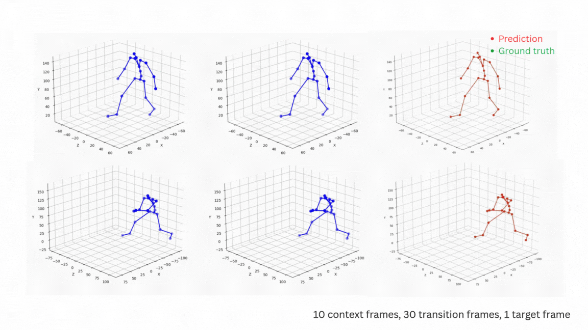

# AI-Assisted Motion In-Betweening

## A Maya-integrated AI tool for generating smooth in-between frames using a Transformer-based model.

## Overview
**BlendTween** is a Maya plugin that automatically generates in-between frames between two artist-defined keyframes. It uses a single-shot Transformer encoder (inspired by SILK) to produce consistent and deterministic motion, ideal for production workflows where reproducibility is essential.
The prototype demonstrates a fully working pipeline inside Maya using a client–server architecture:

Maya plugin → extracts keyframes

Local inference server (PyTorch) → generates in-betweens

Maya → inserts animation curves back into the timeline

This version focuses on validating integration, feasibility, and early-stage motion quality.

## Results (Prototype Preview)
The prediction on LaFAN1

